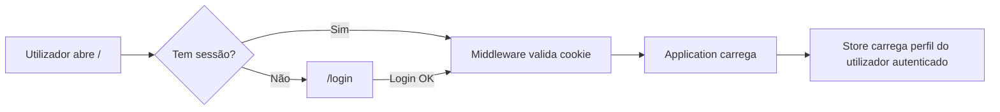

# Plano: Sistema de Login com Supabase Auth

## Objetivo
Implementar autenticação real com email/password para que apenas utilizadores autorizados acedam à plataforma, com o perfil correto automaticamente atribuído.

## Arquitetura

## Utilizadores Demo

| Email | Palavra-passe | Perfil DB | Perfil App |
|-------|--------------|-----------|------------|
| `admin@acrs.pt` | `acrs2026!` | `admin` | João Catalão |
| `secretariado@acrs.pt` | `acrs2026!` | `secretariado` | Vítor |
| `armazem@acrs.pt` | `acrs2026!` | `armazem` | Armazém |
| `terreno@acrs.pt` | `acrs2026!` | `terreno` | Campo |

## Ficheiros a Criar/Modificar

### Novos ficheiros
1. **`app/login/page.tsx`** — Página de login (Server Component que renderiza o formulário)
2. **`components/login.tsx`** — Componente cliente do formulário de login
3. **`app/api/auth/login/route.ts`** — API route para sign-in
4. **`app/api/auth/logout/route.ts`** — API route para sign-out
5. **`lib/supabase/server.ts`** — Utilitário para criar cliente Supabase no server (cookies SSR)
6. **`middleware.ts`** — Protege todas as rotas excepto `/login`
7. **`scripts/seed-auth-users.ts`** — Script para criar os 4 utilizadores no Supabase Auth

### Ficheiros a modificar
1. **`components/store.tsx`** — Carregar o perfil do utilizador autenticado ao inicializar
2. **`components/shell.tsx`** — Substituir o seletor de perfil por info do utilizador + botão de logout
3. **`app/api/state/route.ts`** — Verificar sessão antes de devolver dados
4. **`app/globals.css`** — Estilos para a página de login

## Fluxo de Autenticação

1. Utilizador acede a qualquer rota
2. `middleware.ts` verifica se existe cookie de sessão Supabase
3. Se não existir → redireciona para `/login`
4. Na página `/login`, o utilizador insere email + password
5. O formulário chama `POST /api/auth/login` que faz `supabase.auth.signInWithPassword()`
6. Se sucesso → define cookies de sessão → redireciona para `/`
7. O `store.tsx` carrega o perfil da tabela `profiles` onde `user_id = auth.uid()`
8. A navegação e funcionalidades ficam limitadas ao perfil do utilizador

## Controlo de Acesso por Perfil

| Funcionalidade | admin | secretariado | armazem | terreno |
|---|---|---|---|---|
| Dashboard | ✅ | ✅ | ❌ | ❌ |
| Obras | ✅ | ✅ | ❌ | ❌ |
| Armazém/Stock/Recursos | ✅ | ✅ | ✅ (tablet) | ❌ |
| Faturas & Compras | ✅ | ✅ | ❌ | ✅ (submeter) |
| Pessoas/Ponto | ✅ | ✅ | ❌ | ❌ |
| Orçamentos | ✅ | ❌ | ❌ | ❌ |
| Controlo | ✅ | ❌ | ❌ | ❌ |
| Configuração | ✅ | ❌ | ❌ | ❌ |

> [!IMPORTANT]
> Os orçamentos e margens já estão protegidos via RLS no PostgreSQL — só o perfil `admin` consegue ler a tabela `budgets`.
